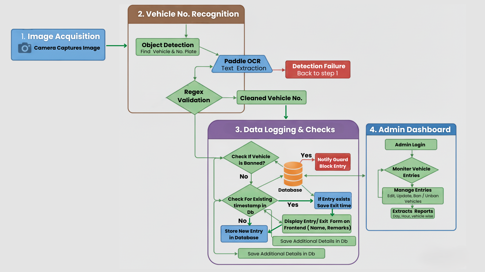
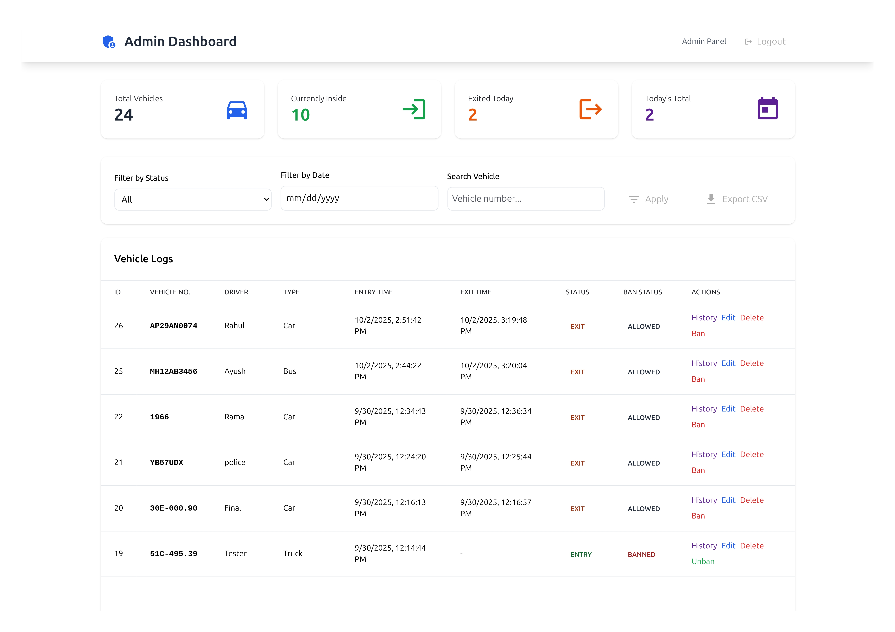
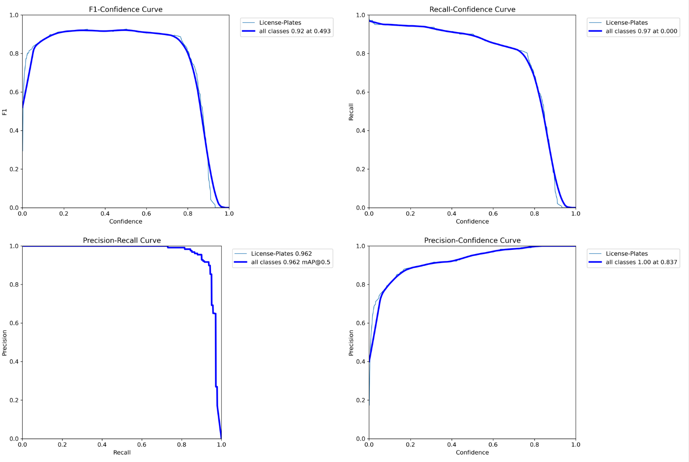
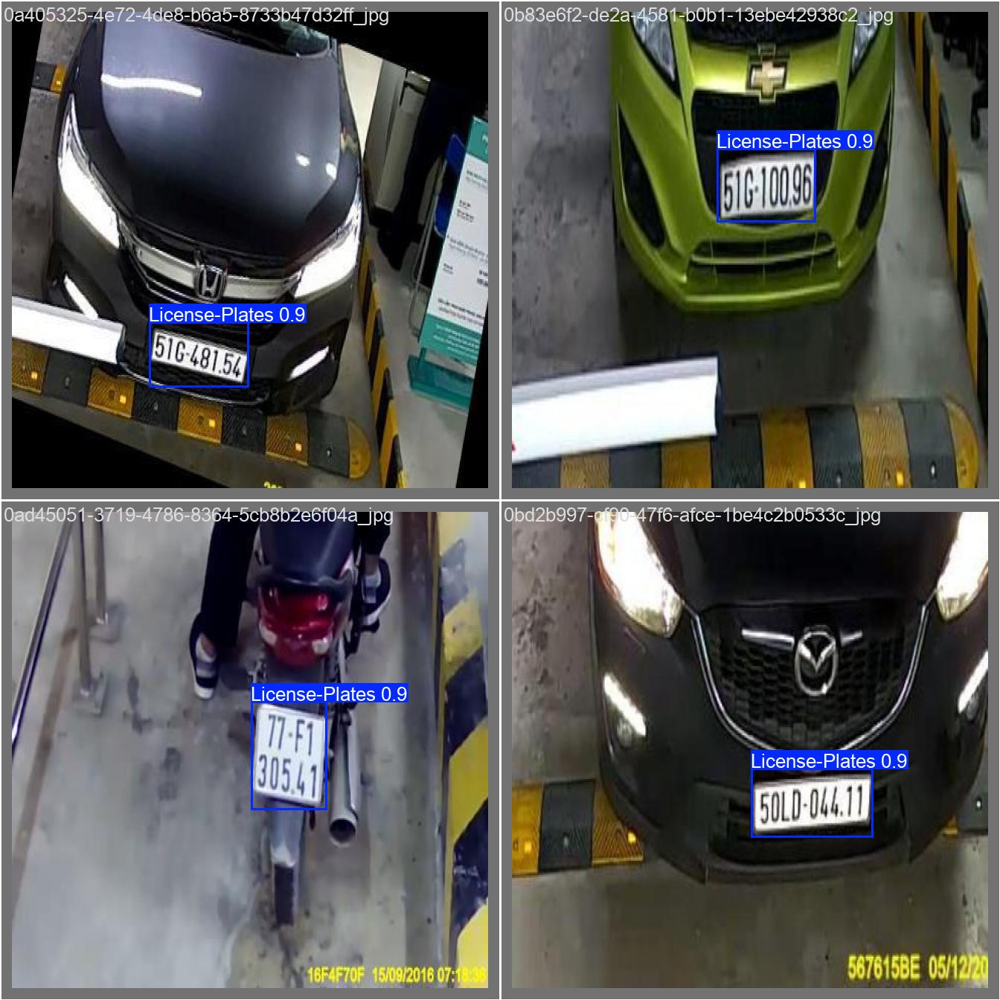

# 🚗 SmartVehEntryAI

An **AI-powered vehicle entry management system** with dual interfaces for staff and administrators. Detects license plates with **YOLO**, extracts text using **PaddleOCR**, validates it with a robust **Regex layer**, and provides comprehensive vehicle tracking with entry/exit management.

Designed for **smart gates, parking systems, security checkpoints, and access-controlled facilities**.

   
-----

##  Features

### Core AI Pipeline

  * **YOLOv8-based Plate Detection** – Custom-trained for high accuracy on Indian number plates.
  * **Robust OCR with PaddleOCR** – Extracts text from plates, even in challenging conditions.
  * **Advanced Number Plate Validation** – A powerful regex layer cleans raw OCR output (e.g., removes noise like "IND") and validates the text against multiple official Indian formats (Standard, BH-Series, Army, Diplomatic, etc.) to ensure high data accuracy.
  * **End-to-End Workflow:** Image/Video → Detect Plate → Extract Text → **Validate & Clean** → Log Result.
  * **Versatile Input** – Works with images, videos, and live camera feeds.
  * **Real-World Ready** – Handles glare, skewed angles, and low-light conditions.

    

-----

## 📂 Project Structure

```
SmartVehEntryAI/
│
├── app.py                  # Staff interface (FastAPI) with OCR & Regex logic
├── admin.py                # Admin panel (FastAPI)
├── database.py             # Database models and setup
├── plate_reader.py         # Core detection + OCR pipeline
│
├── detection_model.pt      # YOLO model weights
├── vehicles.db             # SQLite database (auto-created)
│
├── dataset/                # Training / testing data
│   ├── train/              # Training images & labels
│   ├── val/                # Validation images & labels
│   └── test/               # Test images & labels
│
├── runs/                   # YOLO training outputs (weights, logs)
├── scripts/                # Utility scripts (e.g., data prep)
├── static/                 # Annotated images (auto-created)
│
├── requirements.txt        # Python dependencies
├── start.bat               # Windows startup script
├── start.sh                # Linux/Mac startup script
└── README.md
```

-----


## 🗄️ Database Schema

The SmartVehEntryAI system utilizes an SQLite database (easily adaptable to PostgreSQL) to manage vehicle logs and banned vehicle records. Below is a detailed breakdown of the tables and their respective fields:

### `vehicle_logs` Table

This table stores comprehensive records of all vehicle entries and exits, including detection details and operational metadata.

| Column Name      | Data Type                  | Constraints                                   | Description                                                     |
| :--------------- | :------------------------- | :-------------------------------------------- | :-------------------------------------------------------------- |
| `id`             | `Integer`                  | `PRIMARY KEY`, `INDEX`                        | Unique identifier for each vehicle log entry.                   |
| `vehicle_number` | `String(20)`               | `INDEX`, `NOT NULL`                           | The detected and validated license plate number.                |
| `driver_name`    | `String(100)`              | `NULLABLE`                                    | Name of the vehicle's driver.                                   |
| `vehicle_type`   | `String(50)`               | `NULLABLE`                                    | Type of vehicle (e.g., Car, Truck, Motorcycle).                 |
| `entry_time`     | `DateTime`                 | `NOT NULL`, `DEFAULT=datetime.now`, `INDEX`   | Timestamp when the vehicle entered or was first logged.         |
| `exit_time`      | `DateTime`                 | `NULLABLE`, `DEFAULT=None`, `INDEX`           | Timestamp when the vehicle exited, if applicable.               |
| `status`         | `String(10)`               | `DEFAULT="ENTRY"`                             | Current status of the vehicle log (`ENTRY` or implicitly `EXIT` if `exit_time` is set). |
| `operator_id`    | `String(50)`               | `DEFAULT="system"`                            | Identifier for the operator who logged the entry (or "system"). |
| `image_path`     | `Text`                     | `NULLABLE`                                    | Path to the image file associated with the log entry.           |
| `gate_id`        | `String(50)`               | `DEFAULT="main_gate"`                         | Identifier for the gate where the entry/exit occurred.          |
| `remarks`        | `Text`                     | `DEFAULT=""`                                  | Any additional remarks or notes for the entry.                  |

**Indexes:**
* `idx_entry_time` on `entry_time`
* `idx_exit_time` on `exit_time`
* `idx_vehicle_exit` on `vehicle_number`, `exit_time`

### `banned_vehicles` Table

This table stores records of vehicles that are prohibited from entering the facility.

| Column Name      | Data Type    | Constraints                                   | Description                                                     |
| :--------------- | :----------- | :-------------------------------------------- | :-------------------------------------------------------------- |
| `id`             | `Integer`    | `PRIMARY KEY`, `INDEX`                        | Unique identifier for each banned vehicle record.               |
| `vehicle_number` | `String(20)` | `INDEX`, `NOT NULL`, `UNIQUE`                 | The license plate number of the banned vehicle.                 |
| `reason`         | `Text`       | `NULLABLE`                                    | Reason for banning the vehicle.                                 |
| `banned_at`      | `DateTime`   | `NOT NULL`, `DEFAULT=datetime.now`            | Timestamp when the vehicle was added to the banned list.        |
| `banned_by`      | `String(50)` | `DEFAULT="admin"`                             | User or system responsible for banning the vehicle.             |

---  

-----

## 🚀 Installation

### 1️⃣ Clone & create a virtual environment

```bash
git clone https://github.com/<your-username>/SmartVehEntryAI.git
cd SmartVehEntryAI

conda create -n veh_ai python=3.10
conda activate veh_ai

```

### 2️⃣ Install dependencies

```bash
pip install --upgrade pip
pip install -r requirements.txt
```

> **Requirements:** Python ≥3.10, CUDA-enabled PyTorch for GPU (optional but recommended).

-----

## ⚡ Usage

### Run Both Interfaces

#### **Windows:**

```bash
# Double-click or run from terminal:
start.bat
```

#### **Linux/Mac:**

```bash
chmod +x start.sh
./start.sh

# http://0.0.0.0:8000/ for Input 
# http://0.0.0.0:8000/admin/login for Management
```

**Admin Panel**  | Username: `admin`<br>Password: `admin123`  

  


-----


## 🧠 Training (YOLO)

To retrain the YOLOv8 model on your custom dataset, run the following command:

```bash
yolo task=detect mode=train model=yolov8n.pt data=dataset.yaml epochs=50 imgsz=640
```

**dataset.yaml:**

```yaml
train: dataset/train/images
val: dataset/val/images
nc: 1
names: ["number_plate"]
```

## Training results

    
### Validation
  


-----

## 🛠️ Tech Stack

### Backend

  * [FastAPI](https://fastapi.tiangolo.com/) – Modern, high-performance web framework.
  * [SQLAlchemy](https://www.sqlalchemy.org/) – ORM for database interaction.
  * [Uvicorn](https://www.uvicorn.org/) – Lightning-fast ASGI server.

### AI/ML

  * [YOLOv8](https://github.com/ultralytics/ultralytics) – State-of-the-art license plate detection.
  * [PaddleOCR](https://github.com/PaddlePaddle/PaddleOCR) – High-accuracy OCR engine.
  * [OpenCV](https://opencv.org/) – Real-time computer vision and image processing.
  * **Python `re` Module** - For number plate cleaning and regex validation.

### Frontend

  * [Tailwind CSS](https://tailwindcss.com/) – Utility-first CSS framework for rapid UI development.
  * [Chart.js](https://www.chartjs.org/) – Simple yet flexible data visualization.
  * [Material Icons](https://fonts.google.com/icons) – Clean and modern icons.
  * Vanilla JavaScript – Lightweight and efficient, with no framework overhead.

### Database

  * **SQLite** (Default) – Easy setup, ideal for development and small-scale deployment.
  * **PostgreSQL** (Production Ready) – Easily adaptable for a scalable and robust database.


-----


## 🤝 Contributing

Contributions are welcome\! Please follow these steps:

1.  Fork the repository.
2.  Create a new feature branch (`git checkout -b feature/amazing-feature`).
3.  Commit your changes (`git commit -m 'Add amazing feature'`).
4.  Push to the branch (`git push origin feature/amazing-feature`).
5.  Open a Pull Request.

-----

## License

This project is released under the **MIT License**.

For commercial use or enterprise deployment, please contact the maintainers.

-----

## Acknowledgments

  * YOLOv8 by Ultralytics
  * PaddleOCR by PaddlePaddle
  * The FastAPI framework and its community
  * Tailwind CSS
  * Chart.js

-----

##  Support

For issues, questions, or contributions, please use the following channels:

  * 🐛 **Bugs & Issues:** [Open an issue](https://github.com/shailesh22290/SmartVehEntryAI/issues)
  * 💡 **Feature Requests:** [Start a discussion](https://github.com/shailesh22290/SmartVehEntryAI/discussions)
  * 📧 **Contact:** shailesh22@iiserb.ac.in / shaileshkachhi786@gmail.com

-----
